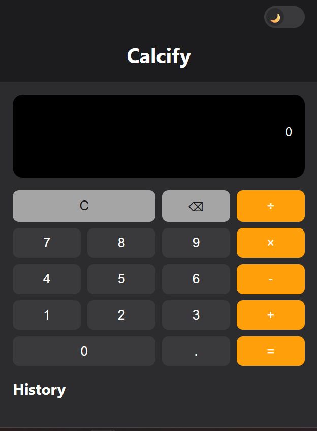

# 🧮 Calcify: Keyboard-Friendly Calculator

A clean, responsive calculator built with vanilla JavaScript. It works with both mouse and
keyboard, handles edge cases, and keeps a history of recent calculations.

**🔗 Live demo:** https://ahmed71huz.github.io/calcify-calculator/

## Features
- Basic operations: addition, subtraction, multiplication, division
- Operation chaining (e.g. `5 + 3 −` calculates `8` first)
- Full keyboard support (numbers, operators, Enter, Backspace, Escape)
- History of the last 5 calculations
- Friendly divide-by-zero message and single decimal point per number
- Responsive layout with CSS Grid
- No `eval()`: all calculation logic written by hand
- Light/dark theme switch with a sliding toggle 
- Starts a new number after "=" like a real calculator 
- Shows "Can't divide by 0" instead of Infinity

## Tech Stack
HTML5 · CSS3 · Vanilla JavaScript · GitHub Pages

## Run Locally
1. Clone the repo: `git clone https://github.com/ahmed71huz/calcify-calculator.git`
2. Open `index.html` in your browser (or use the VS Code Live Server extension).

## What I Learned
- Using guard clauses (`if ... return`) to stop invalid input early
- Looping over arrays with `forEach` and building HTML with `createElement`
- Storing data in HTML with `data-` attributes and reading it with `dataset`
- Selecting many elements at once with `querySelectorAll`
- Managing app state (current, previous, operator) and updating the screen from it
- Keeping a short history with array methods like `unshift` and `slice`